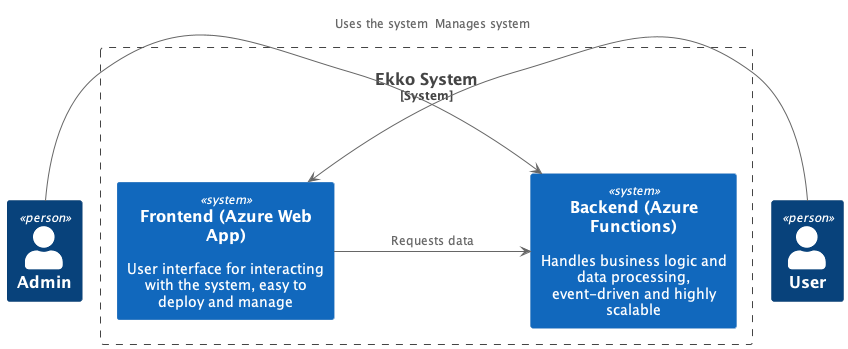
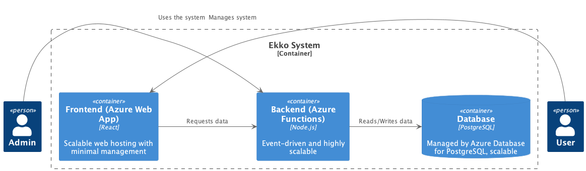
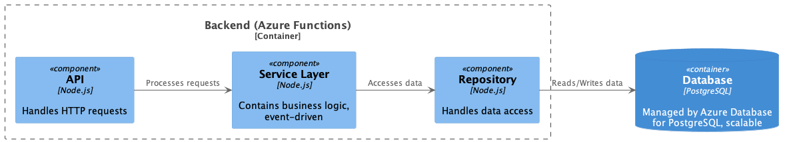
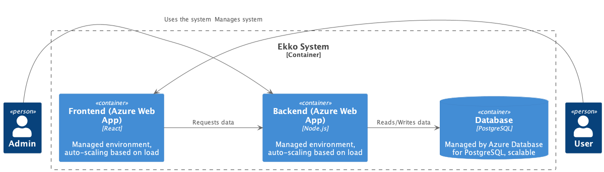
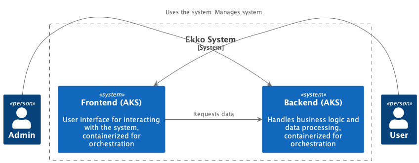
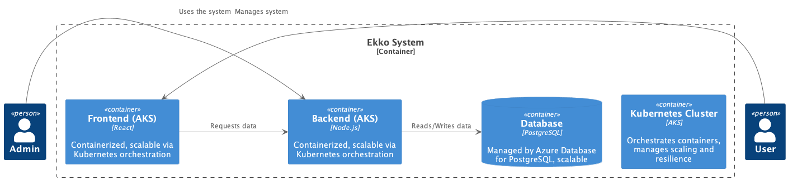
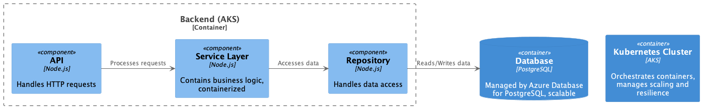

# Ekko Backend

This repository contains the backend for the Ekko application. The backend is built using Node.js and TypeScript, and it connects to a PostgreSQL database. This project can be deployed using different strategies, each with its own advantages and disadvantages.

## Deployment Options

### Option 1: Azure Functions and Azure Web App

#### Overview
In this option, the backend is deployed using Azure Functions, and the frontend is hosted on an Azure Web App. Azure Functions provide an event-driven, highly scalable platform for the backend, while the Azure Web App offers a managed hosting environment for the frontend.

#### Architecture Diagrams
**Context Diagram**


**Container Diagram**


**Component Diagram**


#### Advantages
- **Scalability**: Azure Functions automatically scale to handle increasing load.
- **Cost-effective**: Pay only for the compute resources used.
- **Ease of Management**: Managed environment with minimal infrastructure management.

#### Disadvantages
- **Cold Starts**: Azure Functions can experience delays during cold starts.
- **Complexity**: Requires managing multiple Azure services.

### Option 2: Azure Web Apps for Both API and Web Portion

#### Overview
In this option, both the backend and frontend are deployed using Azure Web Apps. This provides a managed environment for both parts of the application with auto-scaling based on load.

#### Architecture Diagrams
**Context Diagram**


**Container Diagram**


**Component Diagram**


#### Advantages
- **Managed Environment**: Simplifies deployment and management.
- **Auto-scaling**: Automatically scales based on load.

#### Disadvantages
- **Less Flexible**: Less flexibility compared to containerized solutions.
- **Higher Cost**: Can be more expensive than serverless options.

### Option 3: Kubernetes (AKS)

#### Overview
In this option, the backend and frontend are containerized and deployed using Azure Kubernetes Service (AKS). This provides a highly scalable and flexible platform with advanced orchestration capabilities.

#### Architecture Diagrams
**Context Diagram**


**Container Diagram**


**Component Diagram**


#### Advantages
- **High Scalability**: Kubernetes provides advanced scaling capabilities.
- **Flexibility**: Supports complex deployment scenarios and configurations.
- **Resilience**: Built-in resilience and self-healing features.

#### Disadvantages
- **Complexity**: Requires managing Kubernetes clusters and related infrastructure.
- **Cost**: Higher operational costs compared to managed services.

## Getting Started

### Prerequisites
- Node.js v14+
- TypeScript
- PostgreSQL

### Installation
1. Clone the repository:
   ```bash
   git clone https://github.com/ryanrichard19/ekko-backend.git
   cd ekko-backend


## Installation

```bash
$ npm install
```

## Running the app

```bash
# development
$ npm run start

# watch mode
$ npm run start:dev

# production mode
$ npm run start:prod
```

## Test

```bash
# unit tests
$ npm run test

# e2e tests
$ npm run test:e2e

# test coverage
$ npm run test:cov
```