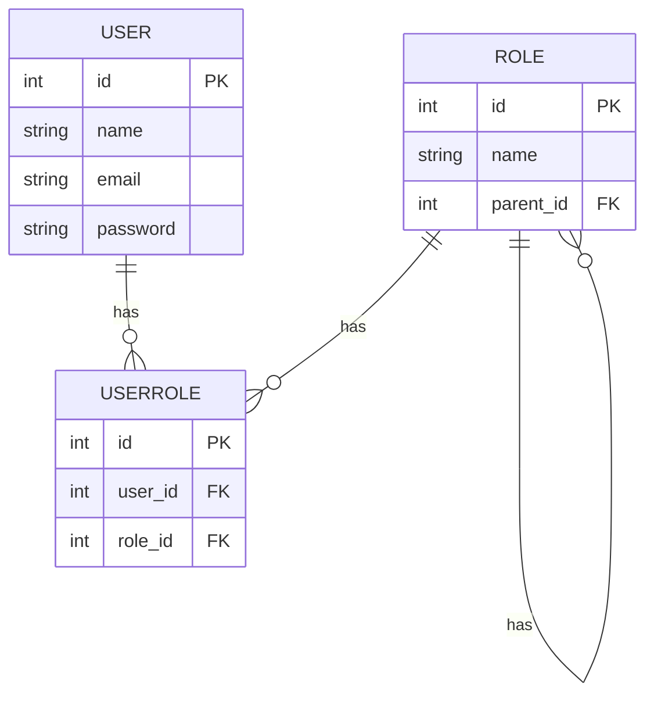

## Entities and Relationships

## USER
Represents a user in the system.

* id: Primary key.
* name: Name of the user.
* email: Email of the user.
* password: Hashed password of the user.

## ROLE

Represents a role in the system, supporting hierarchical structure.

* id: Primary key.
* name: Name of the role.
* parent_id: Foreign key referencing the id within the same ROLE table, establishing a hierarchical relationship.

## USERROLE

Represents the association between users and roles.

* id: Primary key.
* user_id: Foreign key referencing the * USER table.
* role_id: Foreign key referencing the ROLE table.

## Relationships

* A User can have multiple UserRole entries, allowing for multiple roles.
* A Role can have multiple UserRole entries, linking to multiple users.
* A Role can have multiple child roles through the parent_id self-referencing foreign key, supporting a hierarchical structure.

## Key Features

* Hierarchical Data Representation: The system uses self-referencing foreign keys to establish a hierarchy of roles. This enables the representation of complex organizational structures where roles can inherit permissions from their parent roles.
* Access Control Mechanisms: The system enforces access control through role-based permissions. Users can access information based on their roles and the hierarchy of roles within the organization.
* Security and Privacy: The solution ensures that access to user information is restricted based on roles, maintaining privacy and security by design.
* Scalability: The application is designed to handle increasing loads efficiently, ensuring high performance as the number of users grows.
Intuitive and User-Centered: The system is designed to be intuitive, providing a seamless experience for users managing roles and permissions.